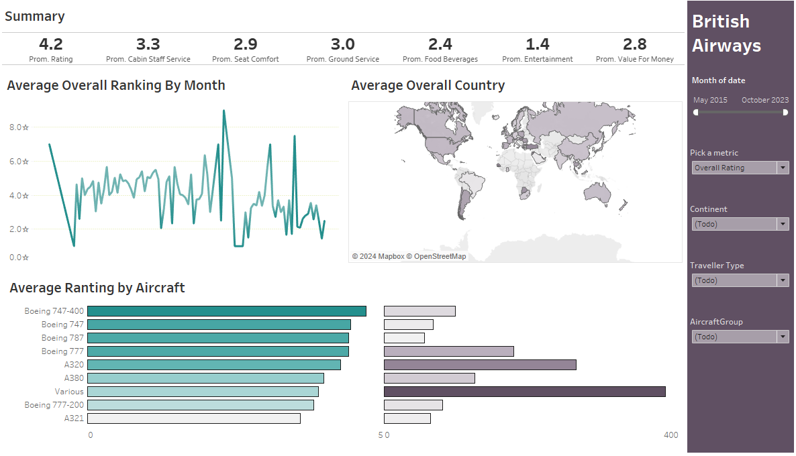

# British Airways Rating Dashboard

## Overview
This interactive dashboard analyzes average ratings from British Airways customers for various aspects of their travel experience, covering data from May 2015 to October 2023.

---

---

## Features and Components

### 1. **Summary Section**
Displays average ratings for key metrics:
- Overall Rating
- Cabin Staff Service
- Seat Comfort
- Ground Service
- Food & Beverages
- Entertainment
- Value for Money

### 2. **Average Overall Ranking By Month (Line Chart)**
Tracks monthly average ratings over time to identify trends and patterns.

### 3. **Average Overall Country (Map)**
A world map showing average ratings by country, with darker shades representing higher satisfaction.

### 4. **Average Rating by Aircraft (Bar Chart)**
Compares average ratings across aircraft models like Boeing 747, Airbus A320, and more.

---

## Filters and Interactivity
Includes filters for:
1. **Date Range**: Focus on specific time periods.
2. **Metric Selector**: Update visualizations by metric.
3. **Continent**: Analyze regional differences.
4. **Traveller Type**: Segment data by traveler category.
5. **Aircraft Group**: Refine analysis for specific aircraft groups.

---

## Purpose
- Identify strengths and weaknesses in customer service.
- Provide insights for improving satisfaction.
- Monitor trends and regional preferences.
- Optimize fleet operations with aircraft-specific insights.

Version en Español [aqui](README-es.md)